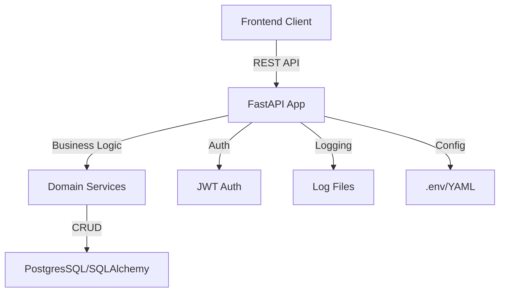

# Juggler BackEnd

## Description

Juggler BackEnd is a production-ready Python REST API for scheduling and resource allocation, built with FastAPI. It manages users, resources, and orders, providing secure authentication, robust business logic, and scalable architecture. The API is consumed by a frontend client and supports admin/user roles, conflict detection, and dynamic resource schemas.

---

## Architecture Overview

- **Framework:** FastAPI (async Python web framework)
- **Database:** PostgresSQL (via SQLAlchemy ORM)
- **Authentication:** JWT (JSON Web Tokens) with access tokens
- **Logging:** YAML-configured, rotating log files, middleware logging
- **Config:** YAML and .env support



---

## Tech Stack

| Component  | Version/Library        |
|------------|------------------------|
| Python     | 3.12+                  |
| FastAPI    | >=0.100                |
| Uvicorn    | >=0.22                 |
| SQLAlchemy | >=2.0                  |
| PyJWT      | >=2.8                  |
| PyYAML     | >=6.0                  |
| Logging    | Standard + YAML config |

---

## Installation & Setup

1. **Clone the repository**

  ```bash
  git clone https://github.com/MichaelUzilevsky/JugglerBE.git
  cd JugglerBE
  ```

2. **Create a virtual environment**

  ```bash
  python3 -m venv venv
  source venv/bin/activate
  ```

3. **Install dependencies**

  ```bash
  pip install -r requirements.txt
  ```

4. **Configure environment variables**

- Copy `.env.example` to `.env` and fill in your secrets:
  ```env
  # Example .env
  APP_ENV=dev
  POSTGRES_HOST=localhost
  POSTGRES_PORT=5432
  POSTGRES_USER=youruser
  POSTGRES_PASSWORD=yourpassword
  POSTGRES_DB=juggler
  JWT_SECRET=your_jwt_secret
  LOG_LEVEL=INFO
  ```
- Edit YAML configs in `app/configs/app/` and `app/configs/logging/` as needed.

5. **Database setup**

- Ensure your PostgresSQL instance is running and accessible.
- Run migration/init scripts in `app/scripts/` if needed:
  ```bash
  python app/scripts/init_db.py
  ```

---

## Running the Application

**Local Development:**

```bash
uvicorn app.main:app --reload
```

**Production:**

```bash
uvicorn app.main:app --host 0.0.0.0 --port 8000 --workers 4
```

---

## API Documentation

- **Swagger UI:** [http://localhost:8000/docs](http://localhost:8000/docs)
- **ReDoc:** [http://localhost:8000/redoc](http://localhost:8000/redoc)

### Authentication

- Login returns a JWT token. Include it in `Authorization: Bearer <token>` for protected endpoints.
- Admin-only endpoints require admin privileges.

---

## Project Structure

```
JugglerBE/
├── app/                # Main application package
│   ├── api/            # FastAPI routes, dependencies, middleware
│   ├── base/           # Config loader, logger setup
│   ├── configs/        # YAML configs for app and logging
│   ├── db/             # SQLAlchemy management
│   ├── domain/         # Business logic, repositories, schemas
│   ├── exceptions/     # Custom exception classes
│   ├── infrastructure/ # Mappers, repository implementations
│   ├── scripts/        # DB init, test scripts
│   ├── utils/          # Utility functions (e.g., password security)
├── logs/               # Log files
├── requirements.txt    # Python dependencies
├── README.md           # Project documentation
```

---

## License

MIT License

---

## Author

Michael Uzilevsky
